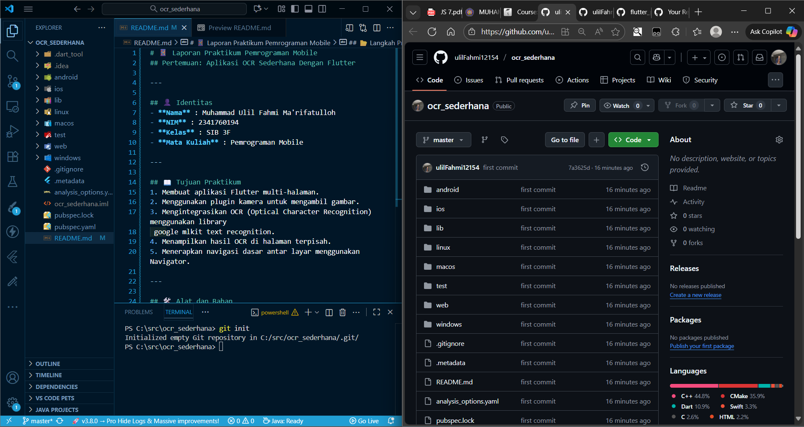
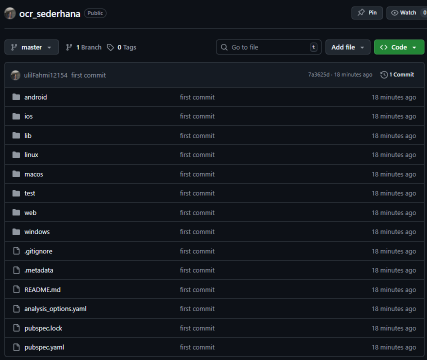
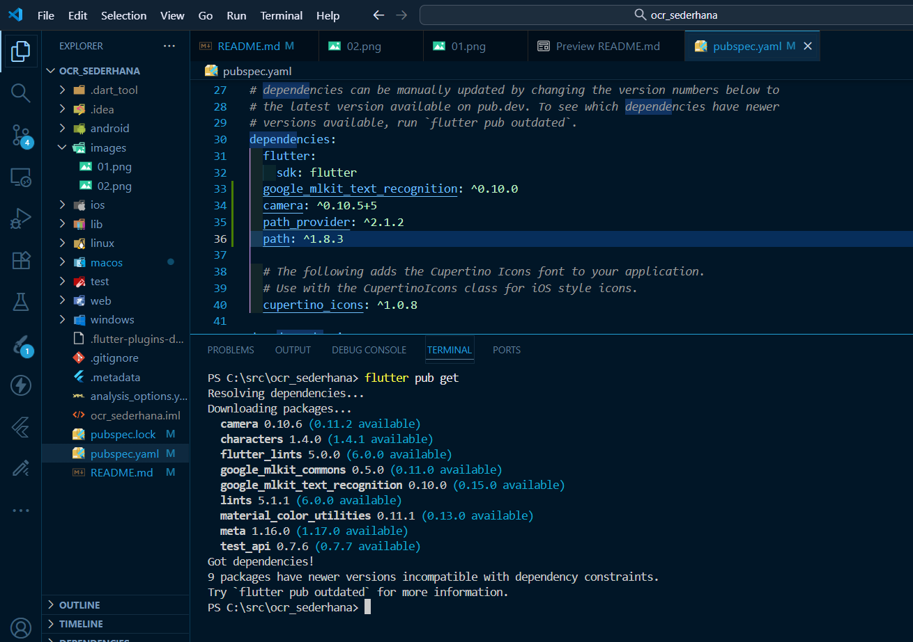
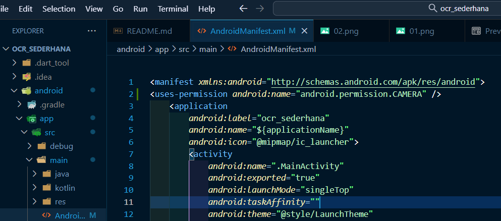
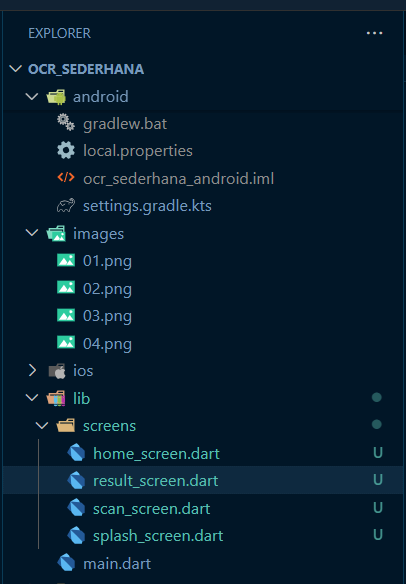
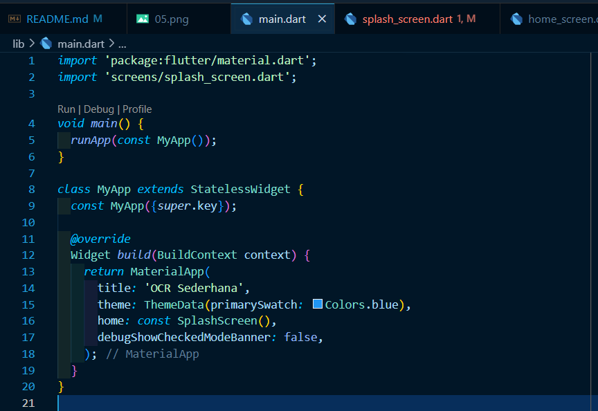
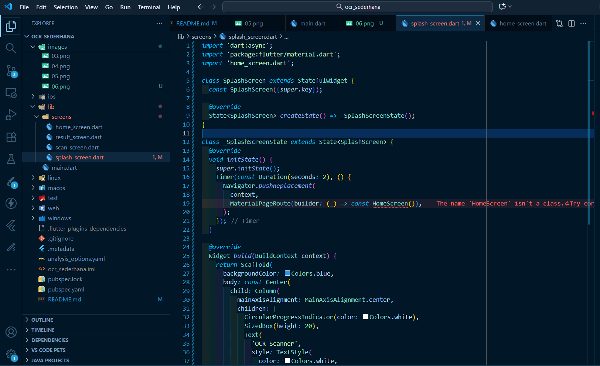

# 📱 Laporan Praktikum Pemrograman Mobile  
## Pertemuan: Aplikasi OCR Sederhana Dengan Flutter

---

## 👤 Identitas
- **Nama** : Muhammad Ulil Fahmi Ma'rifatulloh  
- **NIM** : 2341760194
- **Kelas** : SIB 3F 
- **Mata Kuliah** : Pemrograman Mobile  

---

## 📖 Tujuan Praktikum
1. Membuat aplikasi Flutter multi-halaman.
2. Menggunakan plugin kamera untuk mengambil gambar.
3. Mengintegrasikan OCR (Optical Character Recognition) menggunakan library
 google mlkit text recognition.
4. Menampilkan hasil OCR di halaman terpisah.
5. Menerapkan navigasi dasar antar layar menggunakan Navigator.

---

## 🛠️ Alat dan Bahan
- **Hardware** : Laptop/PC dengan RAM minimal 8GB  
- **Software** :
  - Flutter SDK  
  - Android Studio / VS Code  
  - Emulator Android / Device Fisik  
- **Bahasa Pemrograman** : Dart  

---

## 📂 Langkah Praktikum
### Langkah Kerja 
**Langkah 1:**
- Buat Project Baru

- Project berhasil di push ke repo remote

**Langkah 2:**
- Tambahkan Plugin 

**Langkah 3:**
- Tambahkan Izin Kamera (Android) 

**Langkah 4:**
- Buat Struktur Folder  

### Kode Program
**File: lib/main.dart**
- Listing 3: main.dart

**File: lib/screens/splashscreen.dart**
- Listing 4: splash_screen.dart

