# 📱 Laporan Praktikum Pemrograman Mobile  
## Pertemuan: Aplikasi OCR Sederhana Dengan Flutter

---

## 👤 Identitas
- **Nama** : Muhammad Ulil Fahmi Ma'rifatulloh  
- **NIM** : 2341760194
- **Kelas** : SIB 3F 
- **Mata Kuliah** : Pemrograman Mobile  

---

## 📖 Tujuan Praktikum
1. Membuat aplikasi Flutter multi-halaman.
2. Menggunakan plugin kamera untuk mengambil gambar.
3. Mengintegrasikan OCR (Optical Character Recognition) menggunakan library
 google mlkit text recognition.
4. Menampilkan hasil OCR di halaman terpisah.
5. Menerapkan navigasi dasar antar layar menggunakan Navigator.

---

## 🛠️ Alat dan Bahan
- **Hardware** : Laptop/PC dengan RAM minimal 8GB  
- **Software** :
  - Flutter SDK  
  - Android Studio / VS Code  
  - Emulator Android / Device Fisik  
- **Bahasa Pemrograman** : Dart  

---

## 📂 Langkah Praktikum
### Langkah Kerja 
**Langkah 1:**
- Buat Project Baru

- Project berhasil di push ke repo remote

**Langkah 2:**
- Tambahkan Plugin 

**Langkah 3:**
- Tambahkan Izin Kamera (Android) 

**Langkah 4:**
- Buat Struktur Folder  

### Kode Program
**File: lib/main.dart**
- Listing 3: main.dart

**File: lib/screens/splash_screen.dart**
- Listing 4: splash_screen.dart

**File: lib/screens/home_screen.dart**
- Listing 5: home_screen.dart

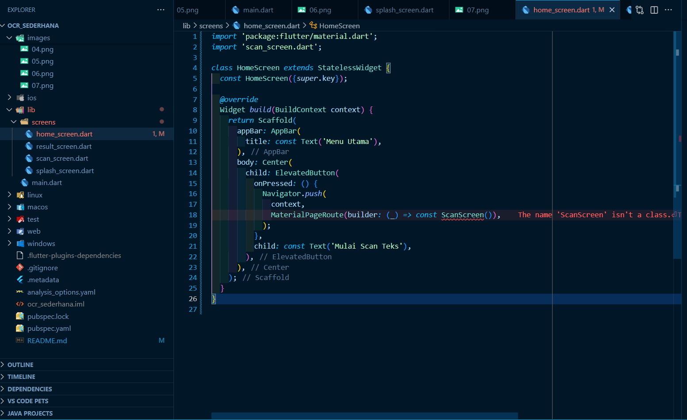

**File: lib/screens/scan_screen.dart**
- Listing 6: scan_screen.dart

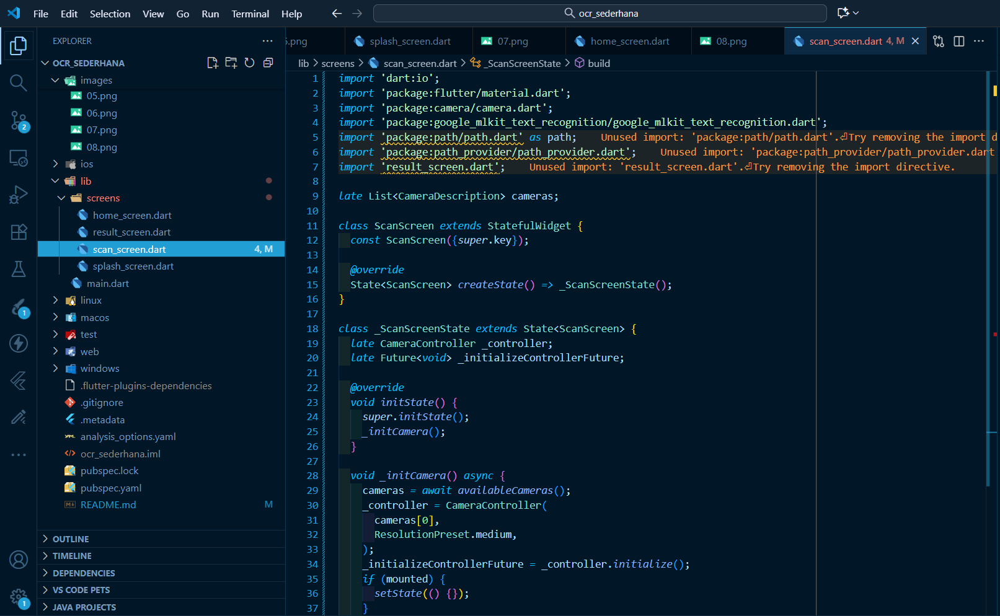

**File: lib/screens/result_screen.dart**
- Listing 7: result_screen.dart

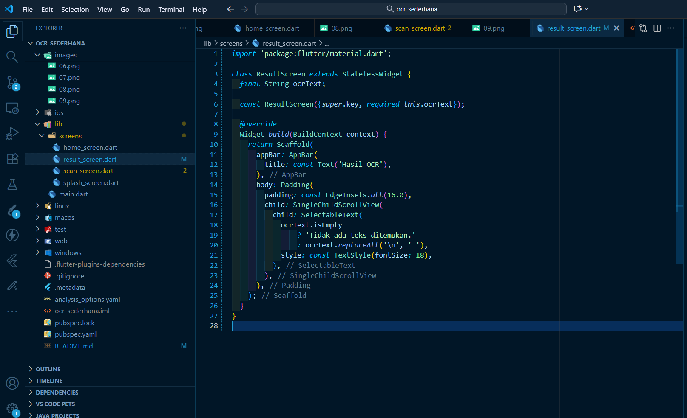

### Tugas Praktikum 
- Jalankan aplikasi di emulator atau HP.

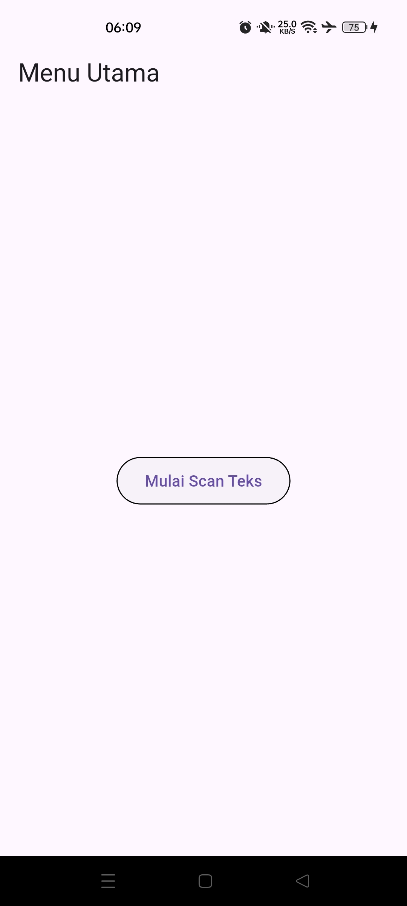

- Lakukan scan terhadap teks cetak (misal: buku, koran, atau layar HP).

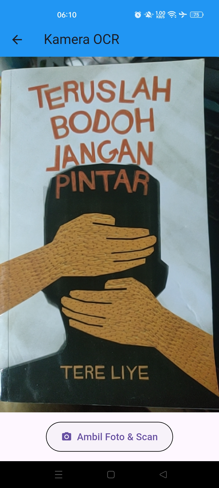

- Amati hasil OCR yang muncul.

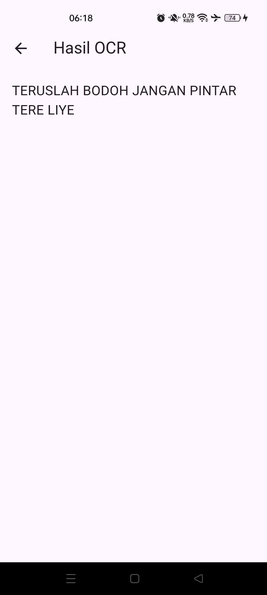

- Jawab pertanyaan berikut:
    -   Apakah semua teks terbaca dengan akurat? Mengapa?
        - Ya, hampir semua teks terbaca dengan akurat.
          Hasil OCR menampilkan teks:
          "TERUSLAH BODOH JANGAN PINTAR TERE LIYE"
          yang sesuai dengan sampul buku.
         
          Hal ini terjadi karena:
        - Tulisan pada gambar jelas, dengan ukuran font yang besar juga dan dengan latar belakang yang kontras.
        - Font yang digunakan sederhana (bukan ala-ala grafiti).
        - Pencahayaan pada gambar baik.
        - Namun jika kondisi pencahayaan sulit (kurang memadai) dan ukuran font yang kecil/rumit, maka hasil OCR menjadi kurang akurat.
    -   Apa kegunaan fitur OCR dalam kehidupan sehari-hari?
        - Fitur OCR (Optical Character Recognition) memungkinkan konversi teks yang terdapat dalam gambar menjadi format digital, sehingga dapat disimpan, disalin, atau diproses secara lebih efisien.

        Kegunaannya dalam kehidupan sehari-hari antara lain:
        - Mempermudah konversi dokumen fisik seperti buku, kwitansi, nota, dan surat menjadi format digital yang dapat disimpan dan diakses dengan lebih praktis.
        - Mendukung proses penerjemahan teks dari gambar, seperti menu makanan atau papan informasi dalam bahasa asing, langsung ke dalam bahasa yang diinginkan.
        - Menghemat waktu dalam pengisian data dari formulir atau identitas dengan mengekstrak teks secara otomatis tanpa perlu mengetik secara manual.

    -   Sebutkan 2 contoh aplikasi nyata yang menggunakan OCR!
        - Google Lens memungkinkan pengguna menyalin, menerjemahkan, dan menelusuri informasi dari teks yang terdapat dalam foto atau tangkapan layar secara langsung.
        - CamScanner memungkinkan pengguna memindai dokumen fisik dan mengekstrak teks secara otomatis, sehingga hasilnya dapat disimpan sebagai file digital atau PDF yang bisa diedit dan dibagikan dengan mudah.

    -   Kesimpulan:
        - OCR mampu mengenali seluruh teks dengan akurat berkat kejernihan gambar dan jenis huruf yang mudah dibaca. Teknologi ini memberikan manfaat besar dalam mengubah informasi fisik menjadi digital serta mempercepat proses kerja yang bergantung pada dokumen.

## 📂 UTS - Pemrograman Mobile - Aplikasi OCR
 Soal 1: Modifikasi Struktur Navigasi dan Aliran (30
 Poin)
 - Pengubahan Navigasi Home (15 Poin):

 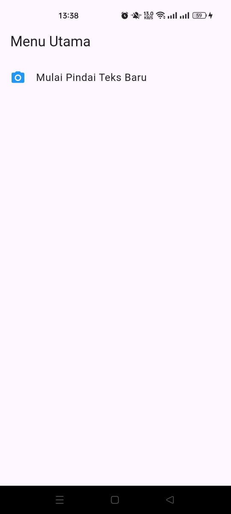

 - Teks Utuh dan Navigasi Balik (15 Poin):

 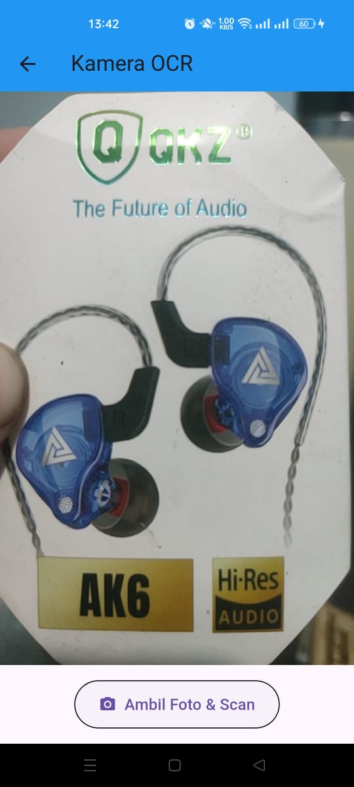 
 
 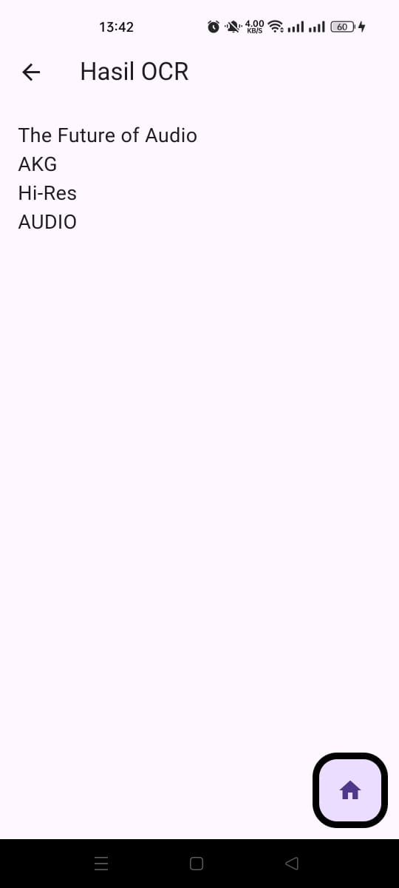

  Soal 2: Penyesuaian Tampilan dan Penanganan State/Error
 (40 Poin)
- Custom Loading Screen di ScanScreen (20 Poin):

 

- Spesifikasi Pesan Error (20 Poin):

 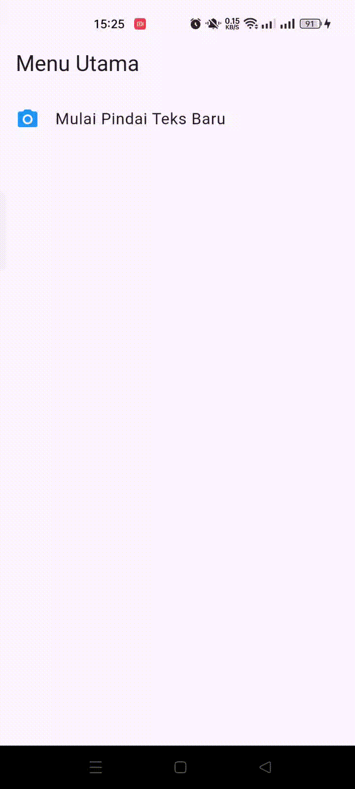

  Soal 3: Implementasi Plugin Text-to-Speech (TTS) (30
 Poin)
 - Instalasi Plugin (5 Poin):
 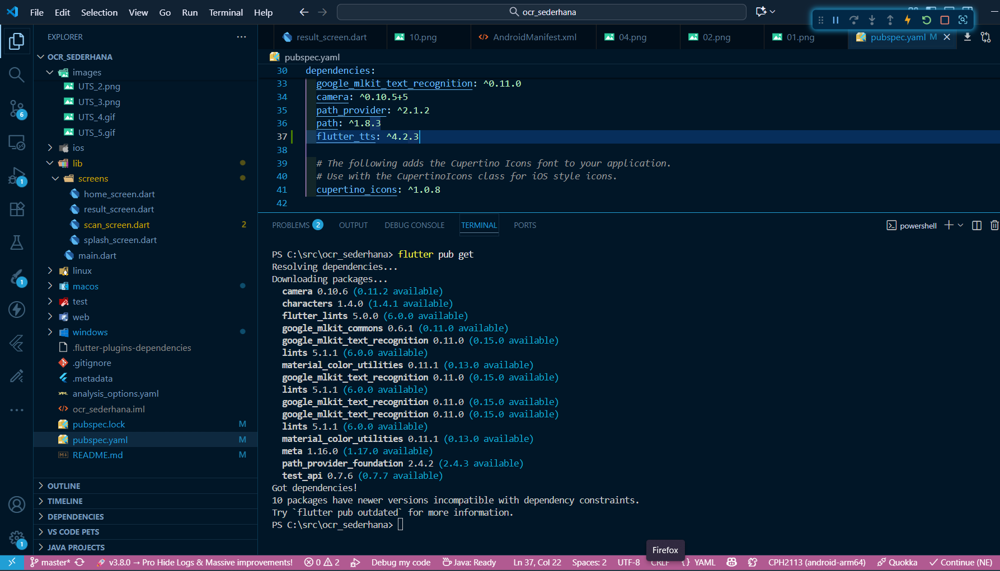

 - Konversi Widget dan Inisialisasi (10 Poin):
 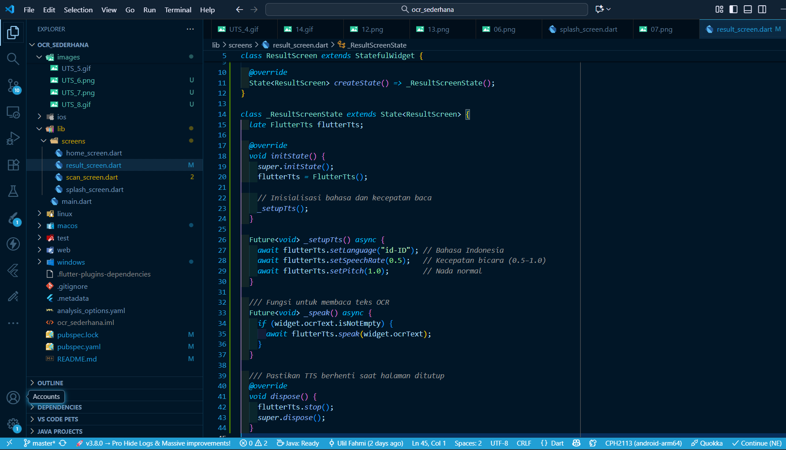

 - Fungsionalitas Pembacaan (15 Poin):
 
  

## 🔗 Link Google Drive
Demo untuk fungsionalitas keseluruhan Soal

[Klik di sini untuk membuka link Google Drive](https://drive.google.com/file/d/17Pd4jSxAvp8yHRHHVAMshM3KgBOmN6R-/view?usp=drive_link)

